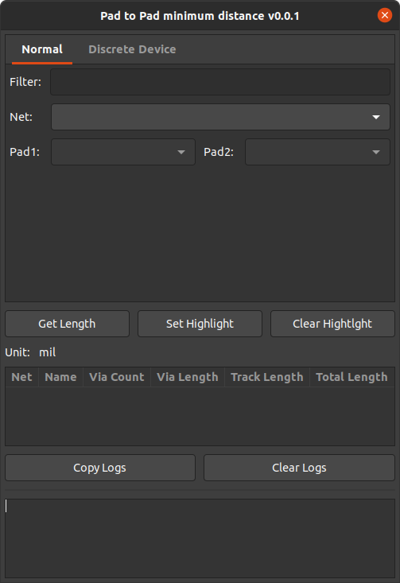
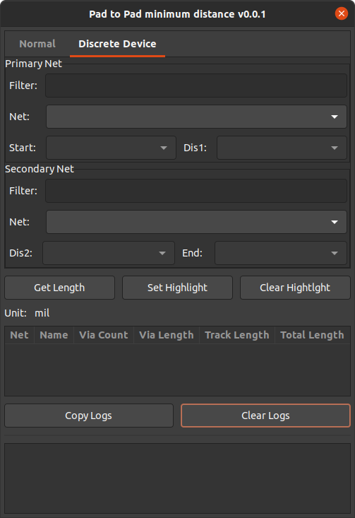
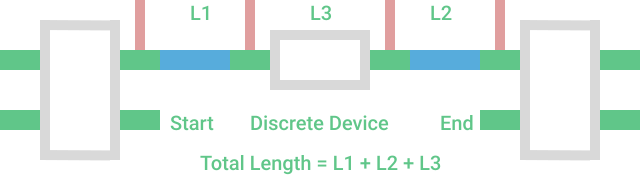

# Pad to Pad minimum distance

## GUI
| Normal               | Discrete Device               |
| ---------------------- | ---------------------- |
|  |  |

## Discrete Device (R,L,C)

## Installation 💾

Add our custom repo to **the Plugin and Content Manager**, the URL is `https://raw.githubusercontent.com/OneKiwiTech/onekiwi-kicad-repository/main/repository.json`

From there you can install the plugin via the GUI.

## Licence and credits
Plugin code is licensed under MIT license, see LICENSE for more info.